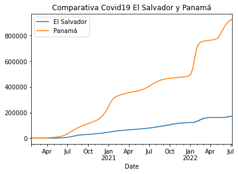

# AD4: conexión con la API de la COVID19 y análisis con Pandas

Me conecto a la API https://api.covid19api.com/


```python
import pandas as pd 
```

### Casos globales de la Covid19
Establezco una variable con el valor de la url.

```python
url = 'https://api.covid19api.com/countries'
```


```python
url 
```


    'https://api.covid19api.com/countries'

### Creo el dataframe
Creamos un dataframe con la función de panda. Luego definimos el dataframe, la estructura de tablas/datos en Phyton y emplearemos la funcion de pd.read_json. Si lo llamo me sale el json en formato de tabla.


```python
df = pd.read_json(url)
```


```python
df
```


<div>
<style scoped>
    .dataframe tbody tr th:only-of-type {
        vertical-align: middle;
    }

    .dataframe tbody tr th {
        vertical-align: top;
    }

    .dataframe thead th {
        text-align: right;
    }
</style>
<table border="1" class="dataframe">
  <thead>
    <tr style="text-align: right;">
      <th></th>
      <th>Country</th>
      <th>Slug</th>
      <th>ISO2</th>
    </tr>
  </thead>
  <tbody>
    <tr>
      <th>0</th>
      <td>Gibraltar</td>
      <td>gibraltar</td>
      <td>GI</td>
    </tr>
    <tr>
      <th>1</th>
      <td>Oman</td>
      <td>oman</td>
      <td>OM</td>
    </tr>
    <tr>
      <th>2</th>
      <td>France</td>
      <td>france</td>
      <td>FR</td>
    </tr>
    <tr>
      <th>3</th>
      <td>Jersey</td>
      <td>jersey</td>
      <td>JE</td>
    </tr>
    <tr>
      <th>4</th>
      <td>Mali</td>
      <td>mali</td>
      <td>ML</td>
    </tr>
    <tr>
      <th>...</th>
      <td>...</td>
      <td>...</td>
      <td>...</td>
    </tr>
    <tr>
      <th>243</th>
      <td>Puerto Rico</td>
      <td>puerto-rico</td>
      <td>PR</td>
    </tr>
    <tr>
      <th>244</th>
      <td>Papua New Guinea</td>
      <td>papua-new-guinea</td>
      <td>PG</td>
    </tr>
    <tr>
      <th>245</th>
      <td>Saint Pierre and Miquelon</td>
      <td>saint-pierre-and-miquelon</td>
      <td>PM</td>
    </tr>
    <tr>
      <th>246</th>
      <td>Timor-Leste</td>
      <td>timor-leste</td>
      <td>TL</td>
    </tr>
    <tr>
      <th>247</th>
      <td>Montenegro</td>
      <td>montenegro</td>
      <td>ME</td>
    </tr>
  </tbody>
</table>
<p>248 rows × 3 columns</p>
</div>


### Datos de la covid19 en España 
Para que me salgan los datos de España creo una lista nueva donde le indico que el país que voy a seleccionar es == a Spain. Esto gracias a que tengo una lista que se llama Country.


```python
df[df['Country'] == 'Spain']
```


<div>
<style scoped>
    .dataframe tbody tr th:only-of-type {
        vertical-align: middle;
    }

    .dataframe tbody tr th {
        vertical-align: top;
    }

    .dataframe thead th {
        text-align: right;
    }
</style>
<table border="1" class="dataframe">
  <thead>
    <tr style="text-align: right;">
      <th></th>
      <th>Country</th>
      <th>Slug</th>
      <th>ISO2</th>
    </tr>
  </thead>
  <tbody>
    <tr>
      <th>141</th>
      <td>Spain</td>
      <td>spain</td>
      <td>ES</td>
    </tr>
  </tbody>
</table>
</div>


Procedo a buscar los datos de España en tiempo real para lo que defino una url que se llama rt (de real time). También creo el objeto df_rt_es, el cual leerá la información de la url.


```python
url_rt_es = 'https://api.covid19api.com/country/spain/status/confirmed/live'
```


```python
df_rt_es = pd.read_json(url_rt_es)
```


```python
df_rt_es
```


<div>
<style scoped>
    .dataframe tbody tr th:only-of-type {
        vertical-align: middle;
    }

    .dataframe tbody tr th {
        vertical-align: top;
    }

    .dataframe thead th {
        text-align: right;
    }
</style>
<table border="1" class="dataframe">
  <thead>
    <tr style="text-align: right;">
      <th></th>
      <th>Country</th>
      <th>CountryCode</th>
      <th>Province</th>
      <th>City</th>
      <th>CityCode</th>
      <th>Lat</th>
      <th>Lon</th>
      <th>Cases</th>
      <th>Status</th>
      <th>Date</th>
    </tr>
  </thead>
  <tbody>
    <tr>
      <th>0</th>
      <td>Spain</td>
      <td>ES</td>
      <td></td>
      <td></td>
      <td></td>
      <td>40.46</td>
      <td>-3.75</td>
      <td>0</td>
      <td>confirmed</td>
      <td>2020-01-22 00:00:00+00:00</td>
    </tr>
    <tr>
      <th>1</th>
      <td>Spain</td>
      <td>ES</td>
      <td></td>
      <td></td>
      <td></td>
      <td>40.46</td>
      <td>-3.75</td>
      <td>0</td>
      <td>confirmed</td>
      <td>2020-01-23 00:00:00+00:00</td>
    </tr>
    <tr>
      <th>2</th>
      <td>Spain</td>
      <td>ES</td>
      <td></td>
      <td></td>
      <td></td>
      <td>40.46</td>
      <td>-3.75</td>
      <td>0</td>
      <td>confirmed</td>
      <td>2020-01-24 00:00:00+00:00</td>
    </tr>
    <tr>
      <th>3</th>
      <td>Spain</td>
      <td>ES</td>
      <td></td>
      <td></td>
      <td></td>
      <td>40.46</td>
      <td>-3.75</td>
      <td>0</td>
      <td>confirmed</td>
      <td>2020-01-25 00:00:00+00:00</td>
    </tr>
    <tr>
      <th>4</th>
      <td>Spain</td>
      <td>ES</td>
      <td></td>
      <td></td>
      <td></td>
      <td>40.46</td>
      <td>-3.75</td>
      <td>0</td>
      <td>confirmed</td>
      <td>2020-01-26 00:00:00+00:00</td>
    </tr>
    <tr>
      <th>...</th>
      <td>...</td>
      <td>...</td>
      <td>...</td>
      <td>...</td>
      <td>...</td>
      <td>...</td>
      <td>...</td>
      <td>...</td>
      <td>...</td>
      <td>...</td>
    </tr>
    <tr>
      <th>893</th>
      <td>Spain</td>
      <td>ES</td>
      <td></td>
      <td></td>
      <td></td>
      <td>40.46</td>
      <td>-3.75</td>
      <td>12818184</td>
      <td>confirmed</td>
      <td>2022-07-03 00:00:00+00:00</td>
    </tr>
    <tr>
      <th>894</th>
      <td>Spain</td>
      <td>ES</td>
      <td></td>
      <td></td>
      <td></td>
      <td>40.46</td>
      <td>-3.75</td>
      <td>12818184</td>
      <td>confirmed</td>
      <td>2022-07-04 00:00:00+00:00</td>
    </tr>
    <tr>
      <th>895</th>
      <td>Spain</td>
      <td>ES</td>
      <td></td>
      <td></td>
      <td></td>
      <td>40.46</td>
      <td>-3.75</td>
      <td>12890002</td>
      <td>confirmed</td>
      <td>2022-07-05 00:00:00+00:00</td>
    </tr>
    <tr>
      <th>896</th>
      <td>Spain</td>
      <td>ES</td>
      <td></td>
      <td></td>
      <td></td>
      <td>40.46</td>
      <td>-3.75</td>
      <td>12890002</td>
      <td>confirmed</td>
      <td>2022-07-06 00:00:00+00:00</td>
    </tr>
    <tr>
      <th>897</th>
      <td>Spain</td>
      <td>ES</td>
      <td></td>
      <td></td>
      <td></td>
      <td>40.46</td>
      <td>-3.75</td>
      <td>12890002</td>
      <td>confirmed</td>
      <td>2022-07-07 00:00:00+00:00</td>
    </tr>
  </tbody>
</table>
<p>898 rows × 10 columns</p>
</div>


#### Casos de España de la parte superior de la tabla de datos 
Esta visualización se logra colocando df_rt_es.head()


```python
df_rt_es.head()
```


<div>
<style scoped>
    .dataframe tbody tr th:only-of-type {
        vertical-align: middle;
    }

    .dataframe tbody tr th {
        vertical-align: top;
    }

    .dataframe thead th {
        text-align: right;
    }
</style>
<table border="1" class="dataframe">
  <thead>
    <tr style="text-align: right;">
      <th></th>
      <th>Country</th>
      <th>CountryCode</th>
      <th>Province</th>
      <th>City</th>
      <th>CityCode</th>
      <th>Lat</th>
      <th>Lon</th>
      <th>Cases</th>
      <th>Status</th>
      <th>Date</th>
    </tr>
  </thead>
  <tbody>
    <tr>
      <th>0</th>
      <td>Spain</td>
      <td>ES</td>
      <td></td>
      <td></td>
      <td></td>
      <td>40.46</td>
      <td>-3.75</td>
      <td>0</td>
      <td>confirmed</td>
      <td>2020-01-22 00:00:00+00:00</td>
    </tr>
    <tr>
      <th>1</th>
      <td>Spain</td>
      <td>ES</td>
      <td></td>
      <td></td>
      <td></td>
      <td>40.46</td>
      <td>-3.75</td>
      <td>0</td>
      <td>confirmed</td>
      <td>2020-01-23 00:00:00+00:00</td>
    </tr>
    <tr>
      <th>2</th>
      <td>Spain</td>
      <td>ES</td>
      <td></td>
      <td></td>
      <td></td>
      <td>40.46</td>
      <td>-3.75</td>
      <td>0</td>
      <td>confirmed</td>
      <td>2020-01-24 00:00:00+00:00</td>
    </tr>
    <tr>
      <th>3</th>
      <td>Spain</td>
      <td>ES</td>
      <td></td>
      <td></td>
      <td></td>
      <td>40.46</td>
      <td>-3.75</td>
      <td>0</td>
      <td>confirmed</td>
      <td>2020-01-25 00:00:00+00:00</td>
    </tr>
    <tr>
      <th>4</th>
      <td>Spain</td>
      <td>ES</td>
      <td></td>
      <td></td>
      <td></td>
      <td>40.46</td>
      <td>-3.75</td>
      <td>0</td>
      <td>confirmed</td>
      <td>2020-01-26 00:00:00+00:00</td>
    </tr>
  </tbody>
</table>
</div>


#### Casos de España de la parte inferior de la tabla de datos
Esta visualización se logra colocando df_rt_es.tail()


```python
df_rt_es.tail()
```


<div>
<style scoped>
    .dataframe tbody tr th:only-of-type {
        vertical-align: middle;
    }

    .dataframe tbody tr th {
        vertical-align: top;
    }

    .dataframe thead th {
        text-align: right;
    }
</style>
<table border="1" class="dataframe">
  <thead>
    <tr style="text-align: right;">
      <th></th>
      <th>Country</th>
      <th>CountryCode</th>
      <th>Province</th>
      <th>City</th>
      <th>CityCode</th>
      <th>Lat</th>
      <th>Lon</th>
      <th>Cases</th>
      <th>Status</th>
      <th>Date</th>
    </tr>
  </thead>
  <tbody>
    <tr>
      <th>893</th>
      <td>Spain</td>
      <td>ES</td>
      <td></td>
      <td></td>
      <td></td>
      <td>40.46</td>
      <td>-3.75</td>
      <td>12818184</td>
      <td>confirmed</td>
      <td>2022-07-03 00:00:00+00:00</td>
    </tr>
    <tr>
      <th>894</th>
      <td>Spain</td>
      <td>ES</td>
      <td></td>
      <td></td>
      <td></td>
      <td>40.46</td>
      <td>-3.75</td>
      <td>12818184</td>
      <td>confirmed</td>
      <td>2022-07-04 00:00:00+00:00</td>
    </tr>
    <tr>
      <th>895</th>
      <td>Spain</td>
      <td>ES</td>
      <td></td>
      <td></td>
      <td></td>
      <td>40.46</td>
      <td>-3.75</td>
      <td>12890002</td>
      <td>confirmed</td>
      <td>2022-07-05 00:00:00+00:00</td>
    </tr>
    <tr>
      <th>896</th>
      <td>Spain</td>
      <td>ES</td>
      <td></td>
      <td></td>
      <td></td>
      <td>40.46</td>
      <td>-3.75</td>
      <td>12890002</td>
      <td>confirmed</td>
      <td>2022-07-06 00:00:00+00:00</td>
    </tr>
    <tr>
      <th>897</th>
      <td>Spain</td>
      <td>ES</td>
      <td></td>
      <td></td>
      <td></td>
      <td>40.46</td>
      <td>-3.75</td>
      <td>12890002</td>
      <td>confirmed</td>
      <td>2022-07-07 00:00:00+00:00</td>
    </tr>
  </tbody>
</table>
</div>


### Visualización de los casos de covid-19 en España
Para visualizar los casos y fechas de España en una gráfica convierto a fecha en columna de control, estableciendo el tiempo específico que deseo saber, en este caso del 1 de enero de 2020 al 30 de junio de 2022. En esta etapa uso la variable plot_rt_es.


```python
df_rt_es.set_index('Date')['Cases'].plot(title='Casos de Covid19 en España desde 20/1/2020 hasta 30/6/2022')
```


    <AxesSubplot:title={'center':'Casos de Covid19 en España desde 20/1/2020 hasta 30/6/2022'}, xlabel='Date'>


    

    


```python
url_es = 'https://api.covid19api.com/country/spain/status/confirmed/live'
df_es = pd.read_json(url_es)
df_es
```


<div>
<style scoped>
    .dataframe tbody tr th:only-of-type {
        vertical-align: middle;
    }

    .dataframe tbody tr th {
        vertical-align: top;
    }

    .dataframe thead th {
        text-align: right;
    }
</style>
<table border="1" class="dataframe">
  <thead>
    <tr style="text-align: right;">
      <th></th>
      <th>Country</th>
      <th>CountryCode</th>
      <th>Province</th>
      <th>City</th>
      <th>CityCode</th>
      <th>Lat</th>
      <th>Lon</th>
      <th>Cases</th>
      <th>Status</th>
      <th>Date</th>
    </tr>
  </thead>
  <tbody>
    <tr>
      <th>0</th>
      <td>Spain</td>
      <td>ES</td>
      <td></td>
      <td></td>
      <td></td>
      <td>40.46</td>
      <td>-3.75</td>
      <td>0</td>
      <td>confirmed</td>
      <td>2020-01-22 00:00:00+00:00</td>
    </tr>
    <tr>
      <th>1</th>
      <td>Spain</td>
      <td>ES</td>
      <td></td>
      <td></td>
      <td></td>
      <td>40.46</td>
      <td>-3.75</td>
      <td>0</td>
      <td>confirmed</td>
      <td>2020-01-23 00:00:00+00:00</td>
    </tr>
    <tr>
      <th>2</th>
      <td>Spain</td>
      <td>ES</td>
      <td></td>
      <td></td>
      <td></td>
      <td>40.46</td>
      <td>-3.75</td>
      <td>0</td>
      <td>confirmed</td>
      <td>2020-01-24 00:00:00+00:00</td>
    </tr>
    <tr>
      <th>3</th>
      <td>Spain</td>
      <td>ES</td>
      <td></td>
      <td></td>
      <td></td>
      <td>40.46</td>
      <td>-3.75</td>
      <td>0</td>
      <td>confirmed</td>
      <td>2020-01-25 00:00:00+00:00</td>
    </tr>
    <tr>
      <th>4</th>
      <td>Spain</td>
      <td>ES</td>
      <td></td>
      <td></td>
      <td></td>
      <td>40.46</td>
      <td>-3.75</td>
      <td>0</td>
      <td>confirmed</td>
      <td>2020-01-26 00:00:00+00:00</td>
    </tr>
    <tr>
      <th>...</th>
      <td>...</td>
      <td>...</td>
      <td>...</td>
      <td>...</td>
      <td>...</td>
      <td>...</td>
      <td>...</td>
      <td>...</td>
      <td>...</td>
      <td>...</td>
    </tr>
    <tr>
      <th>893</th>
      <td>Spain</td>
      <td>ES</td>
      <td></td>
      <td></td>
      <td></td>
      <td>40.46</td>
      <td>-3.75</td>
      <td>12818184</td>
      <td>confirmed</td>
      <td>2022-07-03 00:00:00+00:00</td>
    </tr>
    <tr>
      <th>894</th>
      <td>Spain</td>
      <td>ES</td>
      <td></td>
      <td></td>
      <td></td>
      <td>40.46</td>
      <td>-3.75</td>
      <td>12818184</td>
      <td>confirmed</td>
      <td>2022-07-04 00:00:00+00:00</td>
    </tr>
    <tr>
      <th>895</th>
      <td>Spain</td>
      <td>ES</td>
      <td></td>
      <td></td>
      <td></td>
      <td>40.46</td>
      <td>-3.75</td>
      <td>12890002</td>
      <td>confirmed</td>
      <td>2022-07-05 00:00:00+00:00</td>
    </tr>
    <tr>
      <th>896</th>
      <td>Spain</td>
      <td>ES</td>
      <td></td>
      <td></td>
      <td></td>
      <td>40.46</td>
      <td>-3.75</td>
      <td>12890002</td>
      <td>confirmed</td>
      <td>2022-07-06 00:00:00+00:00</td>
    </tr>
    <tr>
      <th>897</th>
      <td>Spain</td>
      <td>ES</td>
      <td></td>
      <td></td>
      <td></td>
      <td>40.46</td>
      <td>-3.75</td>
      <td>12890002</td>
      <td>confirmed</td>
      <td>2022-07-07 00:00:00+00:00</td>
    </tr>
  </tbody>
</table>
<p>898 rows × 10 columns</p>
</div>


```python
casos_es = df_es.set_index('Date')['Cases']
casos_es.plot(title='Casos de Covid19 en España')
```


    <AxesSubplot:title={'center':'Casos de Covid19 en España'}, xlabel='Date'>


    

    


### Casos de Covid19 de Panamá
Repetimos el mismo proceso, solo que debemos tener cuidado que los datos sean los de Panamá.


```python
df_es = pd.read_json(url_es)
```


```python
url_rt_pa = 'https://api.covid19api.com/country/panama/status/confirmed/live'
```


```python
df_rt_pa = pd.read_json(url_rt_pa)

```


```python
df_rt_pa
```


<div>
<style scoped>
    .dataframe tbody tr th:only-of-type {
        vertical-align: middle;
    }

    .dataframe tbody tr th {
        vertical-align: top;
    }

    .dataframe thead th {
        text-align: right;
    }
</style>
<table border="1" class="dataframe">
  <thead>
    <tr style="text-align: right;">
      <th></th>
      <th>Country</th>
      <th>CountryCode</th>
      <th>Province</th>
      <th>City</th>
      <th>CityCode</th>
      <th>Lat</th>
      <th>Lon</th>
      <th>Cases</th>
      <th>Status</th>
      <th>Date</th>
    </tr>
  </thead>
  <tbody>
    <tr>
      <th>0</th>
      <td>Panama</td>
      <td>PA</td>
      <td></td>
      <td></td>
      <td></td>
      <td>8.54</td>
      <td>-80.78</td>
      <td>0</td>
      <td>confirmed</td>
      <td>2020-01-22 00:00:00+00:00</td>
    </tr>
    <tr>
      <th>1</th>
      <td>Panama</td>
      <td>PA</td>
      <td></td>
      <td></td>
      <td></td>
      <td>8.54</td>
      <td>-80.78</td>
      <td>0</td>
      <td>confirmed</td>
      <td>2020-01-23 00:00:00+00:00</td>
    </tr>
    <tr>
      <th>2</th>
      <td>Panama</td>
      <td>PA</td>
      <td></td>
      <td></td>
      <td></td>
      <td>8.54</td>
      <td>-80.78</td>
      <td>0</td>
      <td>confirmed</td>
      <td>2020-01-24 00:00:00+00:00</td>
    </tr>
    <tr>
      <th>3</th>
      <td>Panama</td>
      <td>PA</td>
      <td></td>
      <td></td>
      <td></td>
      <td>8.54</td>
      <td>-80.78</td>
      <td>0</td>
      <td>confirmed</td>
      <td>2020-01-25 00:00:00+00:00</td>
    </tr>
    <tr>
      <th>4</th>
      <td>Panama</td>
      <td>PA</td>
      <td></td>
      <td></td>
      <td></td>
      <td>8.54</td>
      <td>-80.78</td>
      <td>0</td>
      <td>confirmed</td>
      <td>2020-01-26 00:00:00+00:00</td>
    </tr>
    <tr>
      <th>...</th>
      <td>...</td>
      <td>...</td>
      <td>...</td>
      <td>...</td>
      <td>...</td>
      <td>...</td>
      <td>...</td>
      <td>...</td>
      <td>...</td>
      <td>...</td>
    </tr>
    <tr>
      <th>894</th>
      <td>Panama</td>
      <td>PA</td>
      <td></td>
      <td></td>
      <td></td>
      <td>8.54</td>
      <td>-80.78</td>
      <td>925254</td>
      <td>confirmed</td>
      <td>2022-07-04 00:00:00+00:00</td>
    </tr>
    <tr>
      <th>895</th>
      <td>Panama</td>
      <td>PA</td>
      <td></td>
      <td></td>
      <td></td>
      <td>8.54</td>
      <td>-80.78</td>
      <td>925254</td>
      <td>confirmed</td>
      <td>2022-07-05 00:00:00+00:00</td>
    </tr>
    <tr>
      <th>896</th>
      <td>Panama</td>
      <td>PA</td>
      <td></td>
      <td></td>
      <td></td>
      <td>8.54</td>
      <td>-80.78</td>
      <td>925254</td>
      <td>confirmed</td>
      <td>2022-07-06 00:00:00+00:00</td>
    </tr>
    <tr>
      <th>897</th>
      <td>Panama</td>
      <td>PA</td>
      <td></td>
      <td></td>
      <td></td>
      <td>8.54</td>
      <td>-80.78</td>
      <td>925254</td>
      <td>confirmed</td>
      <td>2022-07-07 00:00:00+00:00</td>
    </tr>
    <tr>
      <th>898</th>
      <td>Panama</td>
      <td>PA</td>
      <td></td>
      <td></td>
      <td></td>
      <td>8.54</td>
      <td>-80.78</td>
      <td>925254</td>
      <td>confirmed</td>
      <td>2022-07-08 00:00:00+00:00</td>
    </tr>
  </tbody>
</table>
<p>899 rows × 10 columns</p>
</div>


```python
casos_pa = df_rt_pa.set_index('Date')['Cases']
casos_pa.plot(title='Casos de Covid19 en Panamá')
```


    <AxesSubplot:title={'center':'Casos de Covid19 en Panamá'}, xlabel='Date'>


    

    


### Ploteamos los países
Es necesario colocar las variables que ya hemos definido para no tener que repetir todo el proceso.


```python
pa_vs_es = pd.concat([casos_es,casos_pa],axis=1)
pa_vs_es
```


<div>
<style scoped>
    .dataframe tbody tr th:only-of-type {
        vertical-align: middle;
    }

    .dataframe tbody tr th {
        vertical-align: top;
    }

    .dataframe thead th {
        text-align: right;
    }
</style>
<table border="1" class="dataframe">
  <thead>
    <tr style="text-align: right;">
      <th></th>
      <th>Cases</th>
      <th>Cases</th>
    </tr>
    <tr>
      <th>Date</th>
      <th></th>
      <th></th>
    </tr>
  </thead>
  <tbody>
    <tr>
      <th>2020-01-22 00:00:00+00:00</th>
      <td>0.0</td>
      <td>0</td>
    </tr>
    <tr>
      <th>2020-01-23 00:00:00+00:00</th>
      <td>0.0</td>
      <td>0</td>
    </tr>
    <tr>
      <th>2020-01-24 00:00:00+00:00</th>
      <td>0.0</td>
      <td>0</td>
    </tr>
    <tr>
      <th>2020-01-25 00:00:00+00:00</th>
      <td>0.0</td>
      <td>0</td>
    </tr>
    <tr>
      <th>2020-01-26 00:00:00+00:00</th>
      <td>0.0</td>
      <td>0</td>
    </tr>
    <tr>
      <th>...</th>
      <td>...</td>
      <td>...</td>
    </tr>
    <tr>
      <th>2022-07-04 00:00:00+00:00</th>
      <td>12818184.0</td>
      <td>925254</td>
    </tr>
    <tr>
      <th>2022-07-05 00:00:00+00:00</th>
      <td>12890002.0</td>
      <td>925254</td>
    </tr>
    <tr>
      <th>2022-07-06 00:00:00+00:00</th>
      <td>12890002.0</td>
      <td>925254</td>
    </tr>
    <tr>
      <th>2022-07-07 00:00:00+00:00</th>
      <td>12890002.0</td>
      <td>925254</td>
    </tr>
    <tr>
      <th>2022-07-08 00:00:00+00:00</th>
      <td>NaN</td>
      <td>925254</td>
    </tr>
  </tbody>
</table>
<p>899 rows × 2 columns</p>
</div>


```python
pa_vs_es.columns = ['España','Panamá']
pa_vs_es
```


<div>
<style scoped>
    .dataframe tbody tr th:only-of-type {
        vertical-align: middle;
    }

    .dataframe tbody tr th {
        vertical-align: top;
    }

    .dataframe thead th {
        text-align: right;
    }
</style>
<table border="1" class="dataframe">
  <thead>
    <tr style="text-align: right;">
      <th></th>
      <th>España</th>
      <th>Panamá</th>
    </tr>
    <tr>
      <th>Date</th>
      <th></th>
      <th></th>
    </tr>
  </thead>
  <tbody>
    <tr>
      <th>2020-01-22 00:00:00+00:00</th>
      <td>0.0</td>
      <td>0</td>
    </tr>
    <tr>
      <th>2020-01-23 00:00:00+00:00</th>
      <td>0.0</td>
      <td>0</td>
    </tr>
    <tr>
      <th>2020-01-24 00:00:00+00:00</th>
      <td>0.0</td>
      <td>0</td>
    </tr>
    <tr>
      <th>2020-01-25 00:00:00+00:00</th>
      <td>0.0</td>
      <td>0</td>
    </tr>
    <tr>
      <th>2020-01-26 00:00:00+00:00</th>
      <td>0.0</td>
      <td>0</td>
    </tr>
    <tr>
      <th>...</th>
      <td>...</td>
      <td>...</td>
    </tr>
    <tr>
      <th>2022-07-04 00:00:00+00:00</th>
      <td>12818184.0</td>
      <td>925254</td>
    </tr>
    <tr>
      <th>2022-07-05 00:00:00+00:00</th>
      <td>12890002.0</td>
      <td>925254</td>
    </tr>
    <tr>
      <th>2022-07-06 00:00:00+00:00</th>
      <td>12890002.0</td>
      <td>925254</td>
    </tr>
    <tr>
      <th>2022-07-07 00:00:00+00:00</th>
      <td>12890002.0</td>
      <td>925254</td>
    </tr>
    <tr>
      <th>2022-07-08 00:00:00+00:00</th>
      <td>NaN</td>
      <td>925254</td>
    </tr>
  </tbody>
</table>
<p>899 rows × 2 columns</p>
</div>


### Gráfica comparativa de los casos de Covid19 en España y Panamá
Ya hemos ploteado los indicadores de ambos países, en primera instacia colocando los casos y luego estableciendo el nombre. Con ellos las líneas de cada país se pueden indentificar con mayor facilidad.


```python
pa_vs_es.plot(title='Comparativa Covid19 España y Panamá')
```


    <AxesSubplot:title={'center':'Comparativa Covid19 España y Panamá'}, xlabel='Date'>


    

    


### Comparativa de casos entre Costa Rica y Panamá
Repetimos nuevamente los pasos, pero en esta ocasión con Costa Rica, con la finalidad de comparar el comportamiento de la pandemia.


```python
url_rt_cr = 'https://api.covid19api.com/country/costa-rica/status/confirmed/live'
df_rt_cr = pd.read_json(url_rt_cr)
casos_cr = df_rt_cr.set_index('Date')['Cases']
```


```python
pa_vs_cr = pd.concat([casos_cr,casos_pa],axis=1)
pa_vs_cr
```


<div>
<style scoped>
    .dataframe tbody tr th:only-of-type {
        vertical-align: middle;
    }

    .dataframe tbody tr th {
        vertical-align: top;
    }

    .dataframe thead th {
        text-align: right;
    }
</style>
<table border="1" class="dataframe">
  <thead>
    <tr style="text-align: right;">
      <th></th>
      <th>Cases</th>
      <th>Cases</th>
    </tr>
    <tr>
      <th>Date</th>
      <th></th>
      <th></th>
    </tr>
  </thead>
  <tbody>
    <tr>
      <th>2020-01-22 00:00:00+00:00</th>
      <td>0</td>
      <td>0</td>
    </tr>
    <tr>
      <th>2020-01-23 00:00:00+00:00</th>
      <td>0</td>
      <td>0</td>
    </tr>
    <tr>
      <th>2020-01-24 00:00:00+00:00</th>
      <td>0</td>
      <td>0</td>
    </tr>
    <tr>
      <th>2020-01-25 00:00:00+00:00</th>
      <td>0</td>
      <td>0</td>
    </tr>
    <tr>
      <th>2020-01-26 00:00:00+00:00</th>
      <td>0</td>
      <td>0</td>
    </tr>
    <tr>
      <th>...</th>
      <td>...</td>
      <td>...</td>
    </tr>
    <tr>
      <th>2022-07-04 00:00:00+00:00</th>
      <td>904934</td>
      <td>925254</td>
    </tr>
    <tr>
      <th>2022-07-05 00:00:00+00:00</th>
      <td>904934</td>
      <td>925254</td>
    </tr>
    <tr>
      <th>2022-07-06 00:00:00+00:00</th>
      <td>904934</td>
      <td>925254</td>
    </tr>
    <tr>
      <th>2022-07-07 00:00:00+00:00</th>
      <td>904934</td>
      <td>925254</td>
    </tr>
    <tr>
      <th>2022-07-08 00:00:00+00:00</th>
      <td>904934</td>
      <td>925254</td>
    </tr>
  </tbody>
</table>
<p>899 rows × 2 columns</p>
</div>


```python
pa_vs_cr.columns = ['Costa Rica','Panamá']
pa_vs_cr
```


<div>
<style scoped>
    .dataframe tbody tr th:only-of-type {
        vertical-align: middle;
    }

    .dataframe tbody tr th {
        vertical-align: top;
    }

    .dataframe thead th {
        text-align: right;
    }
</style>
<table border="1" class="dataframe">
  <thead>
    <tr style="text-align: right;">
      <th></th>
      <th>Costa Rica</th>
      <th>Panamá</th>
    </tr>
    <tr>
      <th>Date</th>
      <th></th>
      <th></th>
    </tr>
  </thead>
  <tbody>
    <tr>
      <th>2020-01-22 00:00:00+00:00</th>
      <td>0</td>
      <td>0</td>
    </tr>
    <tr>
      <th>2020-01-23 00:00:00+00:00</th>
      <td>0</td>
      <td>0</td>
    </tr>
    <tr>
      <th>2020-01-24 00:00:00+00:00</th>
      <td>0</td>
      <td>0</td>
    </tr>
    <tr>
      <th>2020-01-25 00:00:00+00:00</th>
      <td>0</td>
      <td>0</td>
    </tr>
    <tr>
      <th>2020-01-26 00:00:00+00:00</th>
      <td>0</td>
      <td>0</td>
    </tr>
    <tr>
      <th>...</th>
      <td>...</td>
      <td>...</td>
    </tr>
    <tr>
      <th>2022-07-04 00:00:00+00:00</th>
      <td>904934</td>
      <td>925254</td>
    </tr>
    <tr>
      <th>2022-07-05 00:00:00+00:00</th>
      <td>904934</td>
      <td>925254</td>
    </tr>
    <tr>
      <th>2022-07-06 00:00:00+00:00</th>
      <td>904934</td>
      <td>925254</td>
    </tr>
    <tr>
      <th>2022-07-07 00:00:00+00:00</th>
      <td>904934</td>
      <td>925254</td>
    </tr>
    <tr>
      <th>2022-07-08 00:00:00+00:00</th>
      <td>904934</td>
      <td>925254</td>
    </tr>
  </tbody>
</table>
<p>899 rows × 2 columns</p>
</div>


```python
pa_vs_cr.plot(title='Comparativa Covid19 Costa Rica y Panamá')
```


    <AxesSubplot:title={'center':'Comparativa Covid19 Costa Rica y Panamá'}, xlabel='Date'>


    

    


### Comparativa con Centroamérica
Los pasos vuelven a ponerse en práctica, pero en esta ocasión con el resto de los países de la región. Es importante cambiar los países para no colocar el de otros y que haya errores.

-Panamá

-Costa Rica

-Nicaragua

-Guatemala

-El Salvador

-Honduras

#### Gráficas de Panamá vs. el resto de América Central

##### vs. Honduras


```python
url_rt_hon = 'https://api.covid19api.com/country/honduras/status/confirmed/live'
df_rt_hon = pd.read_json(url_rt_hon)
casos_hon = df_rt_hon.set_index('Date')['Cases']
```


```python
pa_vs_hon = pd.concat([casos_hon,casos_pa],axis=1)
pa_vs_hon
```


<div>
<style scoped>
    .dataframe tbody tr th:only-of-type {
        vertical-align: middle;
    }

    .dataframe tbody tr th {
        vertical-align: top;
    }

    .dataframe thead th {
        text-align: right;
    }
</style>
<table border="1" class="dataframe">
  <thead>
    <tr style="text-align: right;">
      <th></th>
      <th>Cases</th>
      <th>Cases</th>
    </tr>
    <tr>
      <th>Date</th>
      <th></th>
      <th></th>
    </tr>
  </thead>
  <tbody>
    <tr>
      <th>2020-01-22 00:00:00+00:00</th>
      <td>0</td>
      <td>0</td>
    </tr>
    <tr>
      <th>2020-01-23 00:00:00+00:00</th>
      <td>0</td>
      <td>0</td>
    </tr>
    <tr>
      <th>2020-01-24 00:00:00+00:00</th>
      <td>0</td>
      <td>0</td>
    </tr>
    <tr>
      <th>2020-01-25 00:00:00+00:00</th>
      <td>0</td>
      <td>0</td>
    </tr>
    <tr>
      <th>2020-01-26 00:00:00+00:00</th>
      <td>0</td>
      <td>0</td>
    </tr>
    <tr>
      <th>...</th>
      <td>...</td>
      <td>...</td>
    </tr>
    <tr>
      <th>2022-07-04 00:00:00+00:00</th>
      <td>427718</td>
      <td>925254</td>
    </tr>
    <tr>
      <th>2022-07-05 00:00:00+00:00</th>
      <td>427718</td>
      <td>925254</td>
    </tr>
    <tr>
      <th>2022-07-06 00:00:00+00:00</th>
      <td>427718</td>
      <td>925254</td>
    </tr>
    <tr>
      <th>2022-07-07 00:00:00+00:00</th>
      <td>427718</td>
      <td>925254</td>
    </tr>
    <tr>
      <th>2022-07-08 00:00:00+00:00</th>
      <td>427718</td>
      <td>925254</td>
    </tr>
  </tbody>
</table>
<p>899 rows × 2 columns</p>
</div>


```python
pa_vs_hon.columns = ['Honduras','Panamá']
pa_vs_hon
```


<div>
<style scoped>
    .dataframe tbody tr th:only-of-type {
        vertical-align: middle;
    }

    .dataframe tbody tr th {
        vertical-align: top;
    }

    .dataframe thead th {
        text-align: right;
    }
</style>
<table border="1" class="dataframe">
  <thead>
    <tr style="text-align: right;">
      <th></th>
      <th>Honduras</th>
      <th>Panamá</th>
    </tr>
    <tr>
      <th>Date</th>
      <th></th>
      <th></th>
    </tr>
  </thead>
  <tbody>
    <tr>
      <th>2020-01-22 00:00:00+00:00</th>
      <td>0</td>
      <td>0</td>
    </tr>
    <tr>
      <th>2020-01-23 00:00:00+00:00</th>
      <td>0</td>
      <td>0</td>
    </tr>
    <tr>
      <th>2020-01-24 00:00:00+00:00</th>
      <td>0</td>
      <td>0</td>
    </tr>
    <tr>
      <th>2020-01-25 00:00:00+00:00</th>
      <td>0</td>
      <td>0</td>
    </tr>
    <tr>
      <th>2020-01-26 00:00:00+00:00</th>
      <td>0</td>
      <td>0</td>
    </tr>
    <tr>
      <th>...</th>
      <td>...</td>
      <td>...</td>
    </tr>
    <tr>
      <th>2022-07-04 00:00:00+00:00</th>
      <td>427718</td>
      <td>925254</td>
    </tr>
    <tr>
      <th>2022-07-05 00:00:00+00:00</th>
      <td>427718</td>
      <td>925254</td>
    </tr>
    <tr>
      <th>2022-07-06 00:00:00+00:00</th>
      <td>427718</td>
      <td>925254</td>
    </tr>
    <tr>
      <th>2022-07-07 00:00:00+00:00</th>
      <td>427718</td>
      <td>925254</td>
    </tr>
    <tr>
      <th>2022-07-08 00:00:00+00:00</th>
      <td>427718</td>
      <td>925254</td>
    </tr>
  </tbody>
</table>
<p>899 rows × 2 columns</p>
</div>


```python
pa_vs_hon.plot(title='Comparativa Covid19 Honduras y Panamá')
```


    <AxesSubplot:title={'center':'Comparativa Covid19 Honduras y Panamá'}, xlabel='Date'>


    

    


##### vs. Nicaragua


```python
url_rt_ni = 'https://api.covid19api.com/country/nicaragua/status/confirmed/live'
df_rt_ni = pd.read_json(url_rt_ni)
casos_ni = df_rt_ni.set_index('Date')['Cases']
```


```python
pa_vs_ni = pd.concat([casos_ni,casos_pa],axis=1)
pa_vs_ni
```


<div>
<style scoped>
    .dataframe tbody tr th:only-of-type {
        vertical-align: middle;
    }

    .dataframe tbody tr th {
        vertical-align: top;
    }

    .dataframe thead th {
        text-align: right;
    }
</style>
<table border="1" class="dataframe">
  <thead>
    <tr style="text-align: right;">
      <th></th>
      <th>Cases</th>
      <th>Cases</th>
    </tr>
    <tr>
      <th>Date</th>
      <th></th>
      <th></th>
    </tr>
  </thead>
  <tbody>
    <tr>
      <th>2020-01-22 00:00:00+00:00</th>
      <td>0</td>
      <td>0</td>
    </tr>
    <tr>
      <th>2020-01-23 00:00:00+00:00</th>
      <td>0</td>
      <td>0</td>
    </tr>
    <tr>
      <th>2020-01-24 00:00:00+00:00</th>
      <td>0</td>
      <td>0</td>
    </tr>
    <tr>
      <th>2020-01-25 00:00:00+00:00</th>
      <td>0</td>
      <td>0</td>
    </tr>
    <tr>
      <th>2020-01-26 00:00:00+00:00</th>
      <td>0</td>
      <td>0</td>
    </tr>
    <tr>
      <th>...</th>
      <td>...</td>
      <td>...</td>
    </tr>
    <tr>
      <th>2022-07-04 00:00:00+00:00</th>
      <td>14690</td>
      <td>925254</td>
    </tr>
    <tr>
      <th>2022-07-05 00:00:00+00:00</th>
      <td>14690</td>
      <td>925254</td>
    </tr>
    <tr>
      <th>2022-07-06 00:00:00+00:00</th>
      <td>14721</td>
      <td>925254</td>
    </tr>
    <tr>
      <th>2022-07-07 00:00:00+00:00</th>
      <td>14721</td>
      <td>925254</td>
    </tr>
    <tr>
      <th>2022-07-08 00:00:00+00:00</th>
      <td>14721</td>
      <td>925254</td>
    </tr>
  </tbody>
</table>
<p>899 rows × 2 columns</p>
</div>


```python
pa_vs_ni.columns = ['Nicaragua','Panamá']
pa_vs_ni
```


<div>
<style scoped>
    .dataframe tbody tr th:only-of-type {
        vertical-align: middle;
    }

    .dataframe tbody tr th {
        vertical-align: top;
    }

    .dataframe thead th {
        text-align: right;
    }
</style>
<table border="1" class="dataframe">
  <thead>
    <tr style="text-align: right;">
      <th></th>
      <th>Nicaragua</th>
      <th>Panamá</th>
    </tr>
    <tr>
      <th>Date</th>
      <th></th>
      <th></th>
    </tr>
  </thead>
  <tbody>
    <tr>
      <th>2020-01-22 00:00:00+00:00</th>
      <td>0</td>
      <td>0</td>
    </tr>
    <tr>
      <th>2020-01-23 00:00:00+00:00</th>
      <td>0</td>
      <td>0</td>
    </tr>
    <tr>
      <th>2020-01-24 00:00:00+00:00</th>
      <td>0</td>
      <td>0</td>
    </tr>
    <tr>
      <th>2020-01-25 00:00:00+00:00</th>
      <td>0</td>
      <td>0</td>
    </tr>
    <tr>
      <th>2020-01-26 00:00:00+00:00</th>
      <td>0</td>
      <td>0</td>
    </tr>
    <tr>
      <th>...</th>
      <td>...</td>
      <td>...</td>
    </tr>
    <tr>
      <th>2022-07-04 00:00:00+00:00</th>
      <td>14690</td>
      <td>925254</td>
    </tr>
    <tr>
      <th>2022-07-05 00:00:00+00:00</th>
      <td>14690</td>
      <td>925254</td>
    </tr>
    <tr>
      <th>2022-07-06 00:00:00+00:00</th>
      <td>14721</td>
      <td>925254</td>
    </tr>
    <tr>
      <th>2022-07-07 00:00:00+00:00</th>
      <td>14721</td>
      <td>925254</td>
    </tr>
    <tr>
      <th>2022-07-08 00:00:00+00:00</th>
      <td>14721</td>
      <td>925254</td>
    </tr>
  </tbody>
</table>
<p>899 rows × 2 columns</p>
</div>


```python
pa_vs_ni.plot(title='Comparativa Covid19 Nicaragua y Panamá')
```


    <AxesSubplot:title={'center':'Comparativa Covid19 Nicaragua y Panamá'}, xlabel='Date'>


    

    


##### vs. Guatemala


```python
url_rt_gua = 'https://api.covid19api.com/country/guatemala/status/confirmed/live'
df_rt_gua = pd.read_json(url_rt_gua)
casos_gua = df_rt_gua.set_index('Date')['Cases']
```


```python
pa_vs_gua = pd.concat([casos_gua,casos_pa],axis=1)
pa_vs_gua
```


<div>
<style scoped>
    .dataframe tbody tr th:only-of-type {
        vertical-align: middle;
    }

    .dataframe tbody tr th {
        vertical-align: top;
    }

    .dataframe thead th {
        text-align: right;
    }
</style>
<table border="1" class="dataframe">
  <thead>
    <tr style="text-align: right;">
      <th></th>
      <th>Cases</th>
      <th>Cases</th>
    </tr>
    <tr>
      <th>Date</th>
      <th></th>
      <th></th>
    </tr>
  </thead>
  <tbody>
    <tr>
      <th>2020-01-22 00:00:00+00:00</th>
      <td>0</td>
      <td>0</td>
    </tr>
    <tr>
      <th>2020-01-23 00:00:00+00:00</th>
      <td>0</td>
      <td>0</td>
    </tr>
    <tr>
      <th>2020-01-24 00:00:00+00:00</th>
      <td>0</td>
      <td>0</td>
    </tr>
    <tr>
      <th>2020-01-25 00:00:00+00:00</th>
      <td>0</td>
      <td>0</td>
    </tr>
    <tr>
      <th>2020-01-26 00:00:00+00:00</th>
      <td>0</td>
      <td>0</td>
    </tr>
    <tr>
      <th>...</th>
      <td>...</td>
      <td>...</td>
    </tr>
    <tr>
      <th>2022-07-04 00:00:00+00:00</th>
      <td>921146</td>
      <td>925254</td>
    </tr>
    <tr>
      <th>2022-07-05 00:00:00+00:00</th>
      <td>922340</td>
      <td>925254</td>
    </tr>
    <tr>
      <th>2022-07-06 00:00:00+00:00</th>
      <td>927473</td>
      <td>925254</td>
    </tr>
    <tr>
      <th>2022-07-07 00:00:00+00:00</th>
      <td>933259</td>
      <td>925254</td>
    </tr>
    <tr>
      <th>2022-07-08 00:00:00+00:00</th>
      <td>933259</td>
      <td>925254</td>
    </tr>
  </tbody>
</table>
<p>899 rows × 2 columns</p>
</div>


```python
pa_vs_gua.columns = ['Guatemala','Panamá']
pa_vs_gua
```


<div>
<style scoped>
    .dataframe tbody tr th:only-of-type {
        vertical-align: middle;
    }

    .dataframe tbody tr th {
        vertical-align: top;
    }

    .dataframe thead th {
        text-align: right;
    }
</style>
<table border="1" class="dataframe">
  <thead>
    <tr style="text-align: right;">
      <th></th>
      <th>Guatemala</th>
      <th>Panamá</th>
    </tr>
    <tr>
      <th>Date</th>
      <th></th>
      <th></th>
    </tr>
  </thead>
  <tbody>
    <tr>
      <th>2020-01-22 00:00:00+00:00</th>
      <td>0</td>
      <td>0</td>
    </tr>
    <tr>
      <th>2020-01-23 00:00:00+00:00</th>
      <td>0</td>
      <td>0</td>
    </tr>
    <tr>
      <th>2020-01-24 00:00:00+00:00</th>
      <td>0</td>
      <td>0</td>
    </tr>
    <tr>
      <th>2020-01-25 00:00:00+00:00</th>
      <td>0</td>
      <td>0</td>
    </tr>
    <tr>
      <th>2020-01-26 00:00:00+00:00</th>
      <td>0</td>
      <td>0</td>
    </tr>
    <tr>
      <th>...</th>
      <td>...</td>
      <td>...</td>
    </tr>
    <tr>
      <th>2022-07-04 00:00:00+00:00</th>
      <td>921146</td>
      <td>925254</td>
    </tr>
    <tr>
      <th>2022-07-05 00:00:00+00:00</th>
      <td>922340</td>
      <td>925254</td>
    </tr>
    <tr>
      <th>2022-07-06 00:00:00+00:00</th>
      <td>927473</td>
      <td>925254</td>
    </tr>
    <tr>
      <th>2022-07-07 00:00:00+00:00</th>
      <td>933259</td>
      <td>925254</td>
    </tr>
    <tr>
      <th>2022-07-08 00:00:00+00:00</th>
      <td>933259</td>
      <td>925254</td>
    </tr>
  </tbody>
</table>
<p>899 rows × 2 columns</p>
</div>


```python
pa_vs_gua.plot(title='Comparativa Covid19 Guatemala y Panamá')
```


    <AxesSubplot:title={'center':'Comparativa Covid19 Guatemala y Panamá'}, xlabel='Date'>


    

    


##### vs. El Salvador


```python
url_rt_sal = 'https://api.covid19api.com/country/el-salvador/status/confirmed/live'
df_rt_sal = pd.read_json(url_rt_sal)
casos_sal = df_rt_sal.set_index('Date')['Cases']
```


```python
pa_vs_sal = pd.concat([casos_sal,casos_pa],axis=1)
pa_vs_sal
```


<div>
<style scoped>
    .dataframe tbody tr th:only-of-type {
        vertical-align: middle;
    }

    .dataframe tbody tr th {
        vertical-align: top;
    }

    .dataframe thead th {
        text-align: right;
    }
</style>
<table border="1" class="dataframe">
  <thead>
    <tr style="text-align: right;">
      <th></th>
      <th>Cases</th>
      <th>Cases</th>
    </tr>
    <tr>
      <th>Date</th>
      <th></th>
      <th></th>
    </tr>
  </thead>
  <tbody>
    <tr>
      <th>2020-01-22 00:00:00+00:00</th>
      <td>0</td>
      <td>0</td>
    </tr>
    <tr>
      <th>2020-01-23 00:00:00+00:00</th>
      <td>0</td>
      <td>0</td>
    </tr>
    <tr>
      <th>2020-01-24 00:00:00+00:00</th>
      <td>0</td>
      <td>0</td>
    </tr>
    <tr>
      <th>2020-01-25 00:00:00+00:00</th>
      <td>0</td>
      <td>0</td>
    </tr>
    <tr>
      <th>2020-01-26 00:00:00+00:00</th>
      <td>0</td>
      <td>0</td>
    </tr>
    <tr>
      <th>...</th>
      <td>...</td>
      <td>...</td>
    </tr>
    <tr>
      <th>2022-07-04 00:00:00+00:00</th>
      <td>169646</td>
      <td>925254</td>
    </tr>
    <tr>
      <th>2022-07-05 00:00:00+00:00</th>
      <td>169646</td>
      <td>925254</td>
    </tr>
    <tr>
      <th>2022-07-06 00:00:00+00:00</th>
      <td>169646</td>
      <td>925254</td>
    </tr>
    <tr>
      <th>2022-07-07 00:00:00+00:00</th>
      <td>169646</td>
      <td>925254</td>
    </tr>
    <tr>
      <th>2022-07-08 00:00:00+00:00</th>
      <td>169646</td>
      <td>925254</td>
    </tr>
  </tbody>
</table>
<p>899 rows × 2 columns</p>
</div>


```python
pa_vs_sal.columns = ['El Salvador','Panamá']
pa_vs_sal
```


<div>
<style scoped>
    .dataframe tbody tr th:only-of-type {
        vertical-align: middle;
    }

    .dataframe tbody tr th {
        vertical-align: top;
    }

    .dataframe thead th {
        text-align: right;
    }
</style>
<table border="1" class="dataframe">
  <thead>
    <tr style="text-align: right;">
      <th></th>
      <th>El Salvador</th>
      <th>Panamá</th>
    </tr>
    <tr>
      <th>Date</th>
      <th></th>
      <th></th>
    </tr>
  </thead>
  <tbody>
    <tr>
      <th>2020-01-22 00:00:00+00:00</th>
      <td>0</td>
      <td>0</td>
    </tr>
    <tr>
      <th>2020-01-23 00:00:00+00:00</th>
      <td>0</td>
      <td>0</td>
    </tr>
    <tr>
      <th>2020-01-24 00:00:00+00:00</th>
      <td>0</td>
      <td>0</td>
    </tr>
    <tr>
      <th>2020-01-25 00:00:00+00:00</th>
      <td>0</td>
      <td>0</td>
    </tr>
    <tr>
      <th>2020-01-26 00:00:00+00:00</th>
      <td>0</td>
      <td>0</td>
    </tr>
    <tr>
      <th>...</th>
      <td>...</td>
      <td>...</td>
    </tr>
    <tr>
      <th>2022-07-04 00:00:00+00:00</th>
      <td>169646</td>
      <td>925254</td>
    </tr>
    <tr>
      <th>2022-07-05 00:00:00+00:00</th>
      <td>169646</td>
      <td>925254</td>
    </tr>
    <tr>
      <th>2022-07-06 00:00:00+00:00</th>
      <td>169646</td>
      <td>925254</td>
    </tr>
    <tr>
      <th>2022-07-07 00:00:00+00:00</th>
      <td>169646</td>
      <td>925254</td>
    </tr>
    <tr>
      <th>2022-07-08 00:00:00+00:00</th>
      <td>169646</td>
      <td>925254</td>
    </tr>
  </tbody>
</table>
<p>899 rows × 2 columns</p>
</div>


```python
pa_vs_sal.plot(title='Comparativa Covid19 El Salvador y Panamá')
```


    <AxesSubplot:title={'center':'Comparativa Covid19 El Salvador y Panamá'}, xlabel='Date'>


    

    


#### Comportamiento de la Covid19 en Centro América
Adicional a repetir los pasos, al momento de generar la gráfica final es importante agrupar los contenidos con concatenación y darles un nombre sencillo. En este caso **ca** incluye los seis países.


```python
df_ca = pd.concat([casos_pa,casos_cr,casos_hon,casos_ni,casos_gua,casos_sal],axis=1)
df_ca
```


<div>
<style scoped>
    .dataframe tbody tr th:only-of-type {
        vertical-align: middle;
    }

    .dataframe tbody tr th {
        vertical-align: top;
    }

    .dataframe thead th {
        text-align: right;
    }
</style>
<table border="1" class="dataframe">
  <thead>
    <tr style="text-align: right;">
      <th></th>
      <th>Cases</th>
      <th>Cases</th>
      <th>Cases</th>
      <th>Cases</th>
      <th>Cases</th>
      <th>Cases</th>
    </tr>
    <tr>
      <th>Date</th>
      <th></th>
      <th></th>
      <th></th>
      <th></th>
      <th></th>
      <th></th>
    </tr>
  </thead>
  <tbody>
    <tr>
      <th>2020-01-22 00:00:00+00:00</th>
      <td>0</td>
      <td>0</td>
      <td>0</td>
      <td>0</td>
      <td>0</td>
      <td>0</td>
    </tr>
    <tr>
      <th>2020-01-23 00:00:00+00:00</th>
      <td>0</td>
      <td>0</td>
      <td>0</td>
      <td>0</td>
      <td>0</td>
      <td>0</td>
    </tr>
    <tr>
      <th>2020-01-24 00:00:00+00:00</th>
      <td>0</td>
      <td>0</td>
      <td>0</td>
      <td>0</td>
      <td>0</td>
      <td>0</td>
    </tr>
    <tr>
      <th>2020-01-25 00:00:00+00:00</th>
      <td>0</td>
      <td>0</td>
      <td>0</td>
      <td>0</td>
      <td>0</td>
      <td>0</td>
    </tr>
    <tr>
      <th>2020-01-26 00:00:00+00:00</th>
      <td>0</td>
      <td>0</td>
      <td>0</td>
      <td>0</td>
      <td>0</td>
      <td>0</td>
    </tr>
    <tr>
      <th>...</th>
      <td>...</td>
      <td>...</td>
      <td>...</td>
      <td>...</td>
      <td>...</td>
      <td>...</td>
    </tr>
    <tr>
      <th>2022-07-04 00:00:00+00:00</th>
      <td>925254</td>
      <td>904934</td>
      <td>427718</td>
      <td>14690</td>
      <td>921146</td>
      <td>169646</td>
    </tr>
    <tr>
      <th>2022-07-05 00:00:00+00:00</th>
      <td>925254</td>
      <td>904934</td>
      <td>427718</td>
      <td>14690</td>
      <td>922340</td>
      <td>169646</td>
    </tr>
    <tr>
      <th>2022-07-06 00:00:00+00:00</th>
      <td>925254</td>
      <td>904934</td>
      <td>427718</td>
      <td>14721</td>
      <td>927473</td>
      <td>169646</td>
    </tr>
    <tr>
      <th>2022-07-07 00:00:00+00:00</th>
      <td>925254</td>
      <td>904934</td>
      <td>427718</td>
      <td>14721</td>
      <td>933259</td>
      <td>169646</td>
    </tr>
    <tr>
      <th>2022-07-08 00:00:00+00:00</th>
      <td>925254</td>
      <td>904934</td>
      <td>427718</td>
      <td>14721</td>
      <td>933259</td>
      <td>169646</td>
    </tr>
  </tbody>
</table>
<p>899 rows × 6 columns</p>
</div>


```python
df_ca.columns = ['Panamá','Costa Rica','Honduras','Nicaragua','Guatemala','El Salvador']
df_ca
```


<div>
<style scoped>
    .dataframe tbody tr th:only-of-type {
        vertical-align: middle;
    }

    .dataframe tbody tr th {
        vertical-align: top;
    }

    .dataframe thead th {
        text-align: right;
    }
</style>
<table border="1" class="dataframe">
  <thead>
    <tr style="text-align: right;">
      <th></th>
      <th>Panamá</th>
      <th>Costa Rica</th>
      <th>Honduras</th>
      <th>Nicaragua</th>
      <th>Guatemala</th>
      <th>El Salvador</th>
    </tr>
    <tr>
      <th>Date</th>
      <th></th>
      <th></th>
      <th></th>
      <th></th>
      <th></th>
      <th></th>
    </tr>
  </thead>
  <tbody>
    <tr>
      <th>2020-01-22 00:00:00+00:00</th>
      <td>0</td>
      <td>0</td>
      <td>0</td>
      <td>0</td>
      <td>0</td>
      <td>0</td>
    </tr>
    <tr>
      <th>2020-01-23 00:00:00+00:00</th>
      <td>0</td>
      <td>0</td>
      <td>0</td>
      <td>0</td>
      <td>0</td>
      <td>0</td>
    </tr>
    <tr>
      <th>2020-01-24 00:00:00+00:00</th>
      <td>0</td>
      <td>0</td>
      <td>0</td>
      <td>0</td>
      <td>0</td>
      <td>0</td>
    </tr>
    <tr>
      <th>2020-01-25 00:00:00+00:00</th>
      <td>0</td>
      <td>0</td>
      <td>0</td>
      <td>0</td>
      <td>0</td>
      <td>0</td>
    </tr>
    <tr>
      <th>2020-01-26 00:00:00+00:00</th>
      <td>0</td>
      <td>0</td>
      <td>0</td>
      <td>0</td>
      <td>0</td>
      <td>0</td>
    </tr>
    <tr>
      <th>...</th>
      <td>...</td>
      <td>...</td>
      <td>...</td>
      <td>...</td>
      <td>...</td>
      <td>...</td>
    </tr>
    <tr>
      <th>2022-07-04 00:00:00+00:00</th>
      <td>925254</td>
      <td>904934</td>
      <td>427718</td>
      <td>14690</td>
      <td>921146</td>
      <td>169646</td>
    </tr>
    <tr>
      <th>2022-07-05 00:00:00+00:00</th>
      <td>925254</td>
      <td>904934</td>
      <td>427718</td>
      <td>14690</td>
      <td>922340</td>
      <td>169646</td>
    </tr>
    <tr>
      <th>2022-07-06 00:00:00+00:00</th>
      <td>925254</td>
      <td>904934</td>
      <td>427718</td>
      <td>14721</td>
      <td>927473</td>
      <td>169646</td>
    </tr>
    <tr>
      <th>2022-07-07 00:00:00+00:00</th>
      <td>925254</td>
      <td>904934</td>
      <td>427718</td>
      <td>14721</td>
      <td>933259</td>
      <td>169646</td>
    </tr>
    <tr>
      <th>2022-07-08 00:00:00+00:00</th>
      <td>925254</td>
      <td>904934</td>
      <td>427718</td>
      <td>14721</td>
      <td>933259</td>
      <td>169646</td>
    </tr>
  </tbody>
</table>
<p>899 rows × 6 columns</p>
</div>


```python
df_ca.plot(title='Comparativa de casos de Covid19 en América Central',logy=True)
```


    <AxesSubplot:title={'center':'Comparativa de casos de Covid19 en América Central'}, xlabel='Date'>


    

    


### ¿Cómo ha sido el comportamiento de la covid-19 en América Central?

Para entender el comportamiento de la covid19 en **Centroamérica** hay que tomar en cuenta el factor político. Este es el caso de Nicaragua, cuyas curvas indican que es el país con menos casos en la región. Sin embargo, hay que considerar  que su gobierno fue señalado por esconder los casos y también por no brindar los reportes diarios.

Situación contraria ocurre con **Costa Rica y Panamá**, en los cuales las cifras se han manejado con mayor transparencia a lo largo de toda la pandemia. Con respecto a los números en Panamá, los contagios han aumentado  durante el último año debido a la relajación conferida por la vacunación. La tierra del Canal empezó con la inmunización en enero de 2021 y desde entonces las estrictas medidas se flexibilizaron y la población también comenzó reducir las medidas de cuidado.

Entre los meses de mayo y junio, de acuerdo con datos de la [Organización Panamericana de la Salud](https://www.bing.com/search?q=los+paises+de+las+americas+deben+redoblar+los+esfueros+para+alcanzar+la+meta+de+70%25&cvid=d0fbbcfcff70410d8e96483482391392&aqs=edge..69i57.23481j0j4&FORM=ANAB01&PC=U531), Centroamérica fue la única subregión que reportó una tendencia a la baja, con una reducción del **32%** de los casos de covid-19 y un descenso del **36%** de las muertes.

En este último punto, la estrategia de vacunación ha sido importante debido a que desde que se implementó, el número de fallecimientos se ha reducido considerablemente.

No obstante, los encargados de las instituciones sanitarias de la región recuerdan que la pandemia todavía no se ha terminado y es importante continuar con las medidas de bioseguridad.

#### Cifras de vacunación en América Central por cada 100,000 habitantes

1. Costa Rica     209,94
2. Panamá         190,77
3. Nicaragua      169,21
4. El Salvador    167,11
5. Honduras       143,14
6. Guatemala      109,84


```python

```
